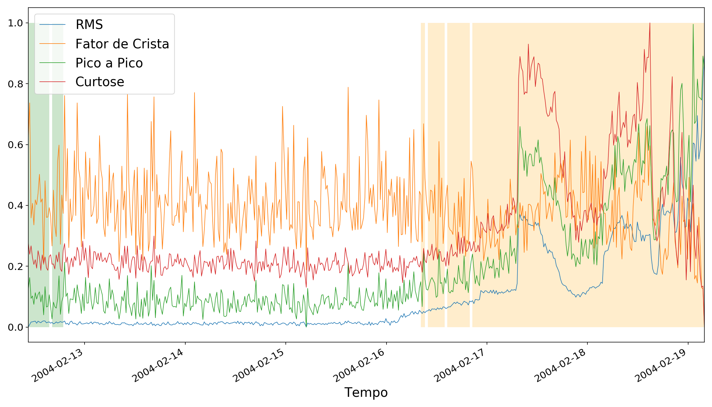

# TCC

Esse repositório contém o código desenvolvido ao longo da escrita do meu 
Trabalho de Conclusão de Curso para a graduação em Engenharia Mecatrônica no
segundo semestre de 2019, e aprovado pela banca examinadora com nota 10.

Mais detalhes podem ser encontrados no trabalho, presente num arquivo PDF na 
raiz desse repositório.

## Subindo o servidor

O servidor principal pode ser executado através dos seguintes comandos -

```
docker-compose build
docker-compose up
```


## Populando o banco de dados

Como um teste da funcionalidade de servidor, foi criado o script `sender.py`. 
Ele simula um cliente, enviando dados do dataset referentes a uma observação de
um segundo do dataset IMS. Os dados nesse script de teste são enviados ao mesmo,
mas a ideia é que uma máquina utilizando o sistema o faça devagar em tempo real.

Para executar o `sender.py` e popular o banco de dados com os dados do dataset
IMS, os seguintes passos devem ser tomados:

* [Baixe](https://ti.arc.nasa.gov/c/3/) e extraia o dataset para uma pasta no 
seu computador
* Modifique o arquivo `docker-compose.yml`, na sessão `volumes` do container 
`app`, para que o container tenha acesso aos arquivos: uma das linhas deve 
conter `- <caminho do diretório IMS no seu computador>:/ims_dataset`. Como 
exemplo, no meu computador, `- /media/pedro/0504B4841DF0737E/BigData/IMS:/ims_dataset`
* Suba o serviço web com `docker-compose up`
* Em outro terminal, execute o script com `docker-compose run app python sender.py`

Os dados serão enviados através de requisições HTTP para o serviço. Os primeiros
200 datapoints são enviados em modo de treinamento, e depois disso o modo de 
treinamento é desativado e o sistema passa a fazer as predições sobre o 
comportamento do sistema (se houve ou não anomalia).

No caso do canal 2 do segundo teste incluído no dataset, após o treinamento há 
um período sem anomalias, e perto do final as anomalias começam a surgir e serem
detectadas.

## Gerando um gráfico de predições

É incluído também um script que analisa os dados diretamente do banco de dados,
e gera um gráfico que mostra o estado do sistema e das características 
analisadas ao longo do tempo, além de indicar quando um alarme seria disparado.
Para os dados enviados por padrão com o `sender.py`, o seguinte gráfico é gerado:



A área verde indica treinamento, e a área laranja indica que o modelo indicou
a deteccção na anomalia do funcionamento normal.

